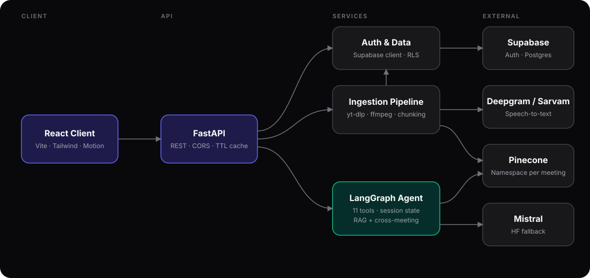
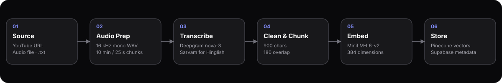
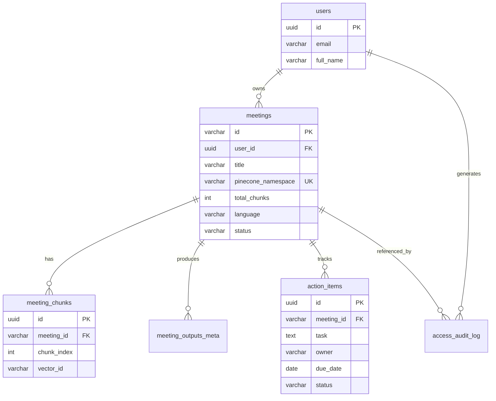

<div align="center">


<br/>


**An AI meeting assistant that transcribes recordings, indexes them as vectors, and lets you chat with every meeting you have ever had.**

[Problem](#problem-statement) · [Solution](#solution) · [Architecture](#architecture) · [Tech Stack](#tech-stack) · [Getting Started](#getting-started) · [API](#api-reference) · [Roadmap](#roadmap)

</div>

---

## Table of Contents

- [Problem Statement](#problem-statement)
- [Solution](#solution)
- [Features](#features)
- [Architecture](#architecture)
- [Ingestion Pipeline](#ingestion-pipeline)
- [Agent Design](#agent-design)
- [Data Model](#data-model)
- [Tech Stack](#tech-stack)
- [Project Structure](#project-structure)
- [Getting Started](#getting-started)
- [Configuration](#configuration)
- [API Reference](#api-reference)
- [Deployment](#deployment)
- [Engineering Challenges](#engineering-challenges)
- [Case Study](#case-study)
- [Results and Outcomes](#results-and-outcomes)
- [Roadmap](#roadmap)
- [Author](#author)

---

## Problem Statement

Meetings produce decisions, commitments, and context, then lose them.

| Pain point | Impact |
| --- | --- |
| Notes are taken manually and inconsistently | Decisions and owners get missed |
| Recordings are long and unsearchable | Nobody rewatches a 60-minute call to find one sentence |
| Context is scattered across many meetings | Tracing how a topic evolved needs manual digging |
| Multilingual teams mix languages mid-sentence | Standard transcription breaks on Hinglish |
| Generic summarizers hallucinate | Invented owners and deadlines create real damage |

## Solution

MeetingSense AI ingests a meeting from a YouTube link, an audio file, or a plain transcript, converts it to text, splits it into semantically searchable chunks, and stores each meeting as an isolated vector namespace. A LangGraph agent then answers questions, extracts action items, writes minutes, and traces topics across meetings, using only what the transcript actually says.

**Design principles**

1. **Grounded answers.** Every prompt forbids inventing facts, owners, or deadlines.
2. **One namespace per meeting.** Retrieval is scoped, fast, and deletable in one call.
3. **Cloud-only querying.** Existing meetings are queried directly from Pinecone with no local file reads.
4. **Tool-routed agent.** The model picks a specialized tool per intent instead of one prompt doing everything.
5. **Language-aware transcription.** Hinglish is routed to a dedicated speech engine.

## Features

| Area | Capability |
| --- | --- |
| Ingestion | YouTube URL, local audio, or `.txt` transcript |
| Transcription | Deepgram `nova-3` for English, Sarvam AI for Hinglish |
| Chat | Retrieval-augmented Q&A over a single meeting |
| Analysis | Top discussion topics, action items, formal minutes, follow-up email drafts |
| Insight | Open questions and disagreement detection |
| Cross-meeting | Trace how a decision or topic changed across past meetings |
| Action items | Create, list, and update status per meeting |
| Auth | Supabase email/password auth with password reset |
| Governance | Row Level Security on every table plus an access audit log |
| Performance | Server-side TTL cache and client-side LRU cache with stale-while-revalidate |

## Architecture



**Request flow**

1. The React client calls the FastAPI backend with a Supabase JWT.
2. The API resolves the user, checks the TTL cache, then delegates to services.
3. Ingestion writes vectors to Pinecone and metadata to Supabase.
4. Chat requests run through a cached per-session `MeetingAgent`, which selects tools and queries Pinecone for context.

## Ingestion Pipeline



| Stage | Details |
| --- | --- |
| Source detection | `.txt` paths skip audio entirely; URLs go through `yt-dlp` |
| Audio prep | Converted to 16 kHz mono WAV, then split into 600 s chunks (25 s for Hinglish) |
| Transcription | Chunk-by-chunk with progress reporting; failed chunks return empty text instead of aborting the run |
| Cleaning | Strips HTML, URLs, emails, markdown symbols, and control characters |
| Chunking | `RecursiveCharacterTextSplitter`, 900 characters, 180 overlap |
| Embedding | `sentence-transformers/all-MiniLM-L6-v2` through the Hugging Face Inference API |
| Storage | Vectors upserted to Pinecone under `namespace = meeting_id`; meeting row written to Supabase |
| Naming | An LLM generates a 3 to 4 word title; the ID is `YYYYMMDD-slug-shortuuid` |

## Agent Design

The agent is built with LangGraph's `create_agent` and a system prompt that treats the transcript as already loaded, so it never asks for a link.

| Tool | Triggered by |
| --- | --- |
| `search_meeting_transcript` | Specific questions about what was said |
| `get_top_discussion_topics` | Summaries, recaps, main topics |
| `extract_action_items` | "What do I need to do?" |
| `generate_meeting_minutes` | Formal written record |
| `draft_followup_email` | Recap emails |
| `find_open_questions` | Unresolved issues |
| `find_disagreements` | Pushback and conflict |
| `search_across_meetings` | Evolution of a topic over time |
| `process_new_meeting` | A new link or file pasted in chat |
| `save_summary_to_file` | Export requests |
| `get_current_datetime` | Deadline and date reasoning |

**Session isolation.** Each conversation is keyed as `user_id:meeting_id`, stored via a `ContextVar`, so concurrent users do not share transcript state.

**LLM provider selection.** Mistral (`mistral-small-latest`) is the default. Setting `LLM_PROVIDER=huggingface`, or omitting the Mistral key, switches to a Hugging Face endpoint (`HUGGINGFACE_MODEL`, default `mistralai/Mistral-7B-Instruct-v0.3`).

## Data Model

Six tables in Supabase Postgres, all with Row Level Security enabled.



A database trigger copies new `auth.users` rows into `public.users`, and another keeps `updated_at` current.

## Tech Stack

| Layer | Technology |
| --- | --- |
| Frontend | React 19, Vite 8, Tailwind CSS 4, Framer Motion, Lucide |
| API | FastAPI, Uvicorn, Pydantic v2, pydantic-settings |
| Agent | LangChain, LangGraph, custom tool layer |
| LLM | Mistral (`mistral-small-latest`), Hugging Face fallback |
| Speech | Deepgram `nova-3`, Sarvam AI |
| Audio | yt-dlp, pydub, ffmpeg |
| Embeddings | `all-MiniLM-L6-v2` (384-dim) via Hugging Face Inference |
| Vector store | Pinecone Serverless, cosine metric |
| Database and auth | Supabase (Postgres, Auth, RLS) |
| Caching | In-memory TTL and LRU cache (server), LRU with sessionStorage (client) |
| Deployment | Docker multi-stage, Render, Vercel |
| Logging | Rich |

## Project Structure

```text
.
├── backend/
│   ├── app.py                    FastAPI application and routes
│   ├── main.py                   Service layer and CLI
│   ├── agent/                    Agent, tools, prompts
│   ├── api/config.py             Typed environment settings
│   ├── audio/                    Download, convert, chunk, transcribe
│   ├── authentication/           Supabase auth service
│   ├── database/                 Client, schema.sql, table operations
│   ├── llm/                      Provider selection and prompts
│   ├── models/                   Generation chains
│   ├── rag_core/                 Chunking, embeddings, vector store, pipeline
│   ├── schemas/                  Pydantic request and response models
│   ├── utils/                    Logger, cache, helpers
│   ├── Dockerfile
│   ├── docker-compose.yml
│   └── render.yaml
└── frontend/
    ├── src/
    │   ├── components/           landing, auth, app workspace, common
    │   ├── context/              Auth and theme providers
    │   └── services/             API client and cache
    ├── index.html
    └── vite.config.js
```

## Getting Started

### Prerequisites

- Python 3.12
- Node.js `^20.19.0` or `>=22.12.0`
- ffmpeg and ffprobe on `PATH` (or set `FFMPEG_LOCATION`)
- Accounts and keys for Supabase, Pinecone, Deepgram, Sarvam, Hugging Face, and Mistral

### 1. Clone

```bash
git clone https://github.com/ravikumar-3481/ai-meeting-assistence.git
cd ai-meeting-assistence
```

### 2. Database

Open the Supabase SQL editor and run `backend/database/schema.sql`.

### 3. Backend

```bash
cd backend
python -m venv .venv
source .venv/bin/activate
pip install -r requirements.txt
cp .env.example .env
uvicorn app:app --reload --port 8000
```

On Windows, activate with `.venv\Scripts\activate`.

Interactive API docs are served at `http://localhost:8000/docs`.

### 4. Frontend

```bash
cd frontend
npm install
echo "VITE_API_URL=http://localhost:8000" > .env
npm run dev
```

### 5. Docker (backend only)

```bash
cd backend
docker compose up --build
```

The container runs as a non-root user and exposes a `/health` check.

### CLI mode

```bash
python main.py --url "https://www.youtube.com/watch?v=..." --language english
python main.py --meeting-id <existing-meeting-id>
python main.py
```

## Configuration

Create `backend/.env`:

| Variable | Required | Purpose |
| --- | --- | --- |
| `SUPABASE_URL` | Yes | Supabase project URL |
| `SUPABASE_ANON_KEY` | Yes | User-scoped, RLS-respecting client |
| `SUPABASE_SERVICE_ROLE_KEY` | Yes | Backend-only admin client |
| `PINECONE_API_KEY` | Yes | Vector database access |
| `PINECONE_INDEX_NAME` | Yes | Index name, created automatically if missing |
| `PINECONE_CLOUD` / `PINECONE_REGION` | No | Default `aws` / `us-east-1` |
| `DEEPGRAM_API_KEY` | Yes | English transcription |
| `SARVAM_API_KEY` | Yes | Hinglish transcription |
| `SARVAM_STT_TRANSLATE_URL` | Yes | Sarvam endpoint |
| `SARVAM_MODEL` | Yes | Sarvam model name |
| `MISTRAL_API_KEY` | One of | Default LLM |
| `HUGGINGFACE_API_TOKEN` | Yes | Embeddings and optional LLM fallback |
| `LLM_PROVIDER` | No | `auto` or `huggingface` |
| `ALLOWED_ORIGINS` | No | Comma-separated CORS origins |
| `FFMPEG_LOCATION` | No | Custom ffmpeg path |

Frontend: `VITE_API_URL` points to the backend.

> The service role key bypasses Row Level Security. Keep it on the server only.

## API Reference

All routes are prefixed with `/api/v1` unless noted.

| Method | Route | Description |
| --- | --- | --- |
| GET | `/health` | Service health (unprefixed) |
| POST | `/auth/register` | Create account |
| POST | `/auth/login` | Sign in, returns tokens |
| POST | `/auth/logout` | Sign out and clear cached profile |
| POST | `/auth/reset-password` | Send reset email |
| GET | `/auth/me` | Current profile |
| PUT | `/auth/profile` | Update name or email |
| POST | `/meetings/process` | Ingest a URL, file path, or transcript |
| POST | `/meetings/load` | Open an existing meeting session |
| GET | `/meetings` | List meetings |
| GET | `/meetings/{id}/chunks` | Chunk records |
| GET | `/meetings/{id}/outputs` | Generated output history |
| GET / POST | `/meetings/{id}/action-items` | List or create action items |
| PATCH | `/action-items/{id}` | Update action item status |
| POST | `/audio/transcribe` | Transcribe an uploaded file or URL |
| POST | `/chat/query` | Ask the meeting agent |
| POST | `/chat/cross-meeting` | Ask across recent meetings |
| GET | `/audit-logs` | Access audit trail |
| GET / POST | `/cache/stats`, `/cache/clear` | Cache diagnostics |

**Example**

```bash
curl -X POST http://localhost:8000/api/v1/chat/query \
  -H "Authorization: Bearer <token>" \
  -H "Content-Type: application/json" \
  -d '{"meeting_id": "20260914-sprint-planning-a1b2c3", "question": "What are the action items?"}'
```

## Deployment

| Component | Platform | Notes |
| --- | --- | --- |
| Backend | Render (`render.yaml`) or Docker | Set secrets in the dashboard; 1 to 3 instances |
| Backend (alternative) | Vercel (`vercel.json`) | `@vercel/python` build |
| Frontend | Vercel | Set `VITE_API_URL` to the backend URL |

Set `ALLOWED_ORIGINS` to the deployed frontend origin so CORS and credentials work correctly.

## Engineering Challenges

| Challenge | What made it hard | Approach |
| --- | --- | --- |
| Multilingual audio | Hinglish mixes two languages inside one sentence | Route Hinglish to Sarvam with short 25 s chunks; English to Deepgram with 10 minute chunks |
| Hallucinated summaries | LLMs invent owners and deadlines | Shared style rules forbid inventing facts; prompts define exact fallback phrases such as "No action items were assigned" |
| Per-user state in a shared process | Global session variables leak between concurrent users | `ContextVar` for the active session plus a session store keyed by `user_id:meeting_id` |
| Cross-meeting reasoning | Chunks from different meetings lose their time order | Group excerpts by meeting and date, sort oldest to newest, then ask the model to trace changes |
| Agent routing | A single tool set caused ambiguous tool choice | Explicit routing rules in the system prompt plus narrow, well-described tools |
| Large transcripts vs. tiny context windows | Full transcripts do not fit in one prompt | Chunked retrieval for Q&A; sampled retrieval for summary-style tools |
| Fragile external APIs | Speech and embedding calls fail intermittently | Retries on embeddings, empty-string fallbacks on failed audio chunks, LLM provider fallback |
| Latency | Repeated identical requests waste tokens and time | Server TTL cache (profiles, meetings, chunks, chat) and client LRU cache with stale-while-revalidate |
| Deployment portability | Same code must run locally, on Render, and in Docker | Typed settings, dynamic `$PORT`, multi-stage Docker image, non-root user |
| Data isolation | Vectors and rows must stay per-user | Namespace per meeting, RLS on all tables, audit log for reads and queries |

## Case Study

**Scenario: a product team's weekly planning calls**

A team runs one planning call every week. After six weeks, a new stakeholder asks: *"When did we decide to delay the export feature, and why?"*

**Without MeetingSense AI**

1. Someone searches chat history and scattered notes.
2. Two people rewatch parts of three recordings.
3. The answer arrives hours later, with uncertain accuracy.

**With MeetingSense AI**

1. Each recording was ingested once, from a YouTube link or uploaded audio.
2. The stakeholder asks the cross-meeting question in chat.
3. The agent calls `search_across_meetings`, retrieves relevant excerpts from each of the recent meetings, orders them by date, and explains how the decision moved from "open" to "delayed", citing which meeting each shift came from.
4. Follow-up: *"What action items came out of it?"* calls `extract_action_items` and returns task, owner, and due date, or states plainly when none were assigned.
5. One click drafts a recap email for the team.

**Why it works:** retrieval is scoped by meeting, results are date-ordered before reaching the model, and prompts require the answer to stay inside the excerpts.

## Results and Outcomes

**What the system delivers today**

| Metric | Value |
| --- | --- |
| Agent tools | 11 (5 core, 6 analysis and cross-meeting) |
| REST endpoints | 21 |
| Database tables with RLS | 6 |
| Supported input types | YouTube URL, audio file, text transcript |
| Transcription engines | 2, selected by language |
| Embedding dimension | 384, cosine similarity |
| Chunk configuration | 900 characters with 180 overlap |
| Cache layers | 2 (server TTL, client LRU) |
| Container security | Non-root user, health check, multi-stage build |

**Outcomes**

- A full ingestion-to-chat loop running end to end: audio in, grounded answers out.
- Every meeting is independently deletable, since it lives in its own vector namespace.
- Multilingual support without forcing users to pick one language per meeting manually.
- A clean service layer shared by the CLI and the REST API, so new clients can reuse the same logic.
- Production-shaped deployment: typed configuration, containerization, and platform configs for Render and Vercel.

**Skills demonstrated:** retrieval-augmented generation, agent tool design, prompt engineering for factual grounding, multi-tenant data modeling, async API design, and full-stack delivery.

## Roadmap

- [ ] Reject invalid or expired tokens instead of falling back to a guest identity
- [ ] Filter meeting lists strictly by authenticated user
- [ ] Include the user ID in chat and cross-meeting cache keys
- [ ] Real speaker diarization and analytics in place of the current placeholder panels
- [ ] Server-side generation for the Executive Summary tab
- [ ] Streaming responses in the chat interface
- [ ] Export to PDF and Markdown
- [ ] Jira, Slack, and Notion sync for action items
- [ ] Automated tests and CI pipeline
- [ ] Measured benchmarks: transcription accuracy, retrieval precision, end-to-end latency

## Author

**Ravi Kumar** · [@ravikumar-3481](https://github.com/ravikumar-3481)

If this project helped you, consider giving it a star.
